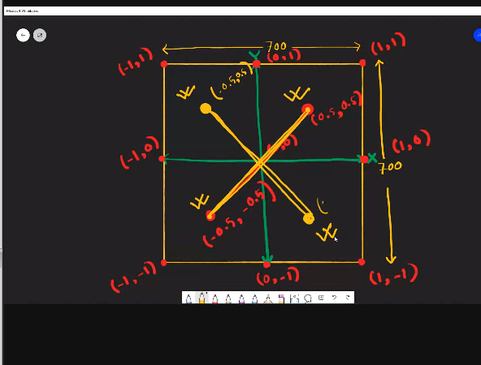
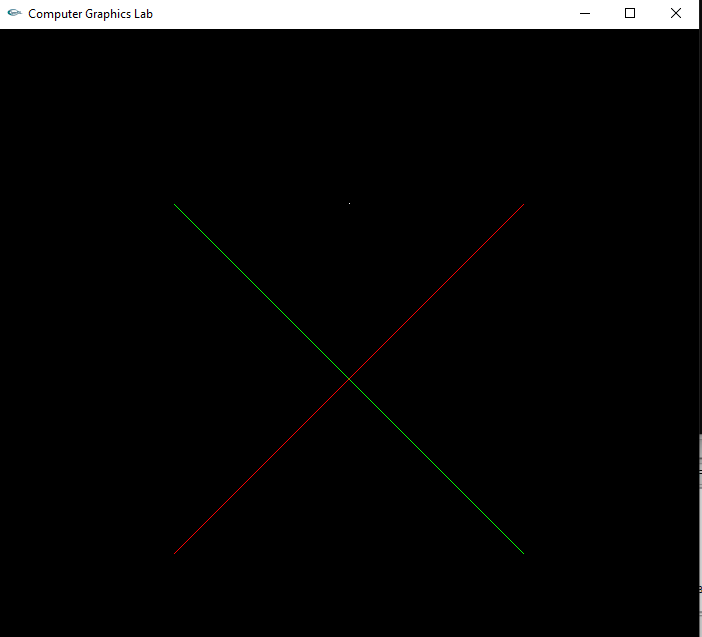
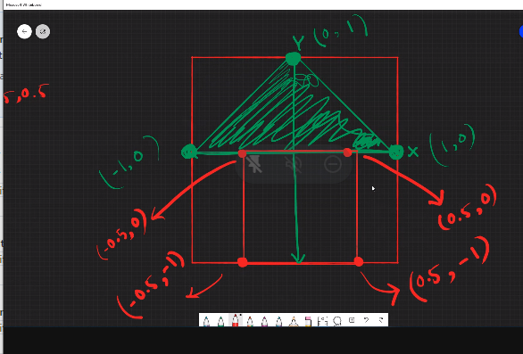
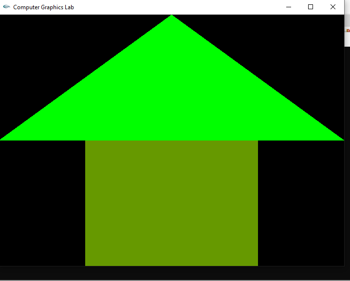
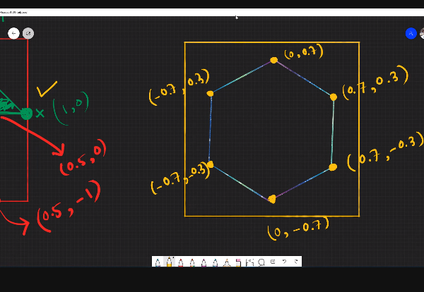
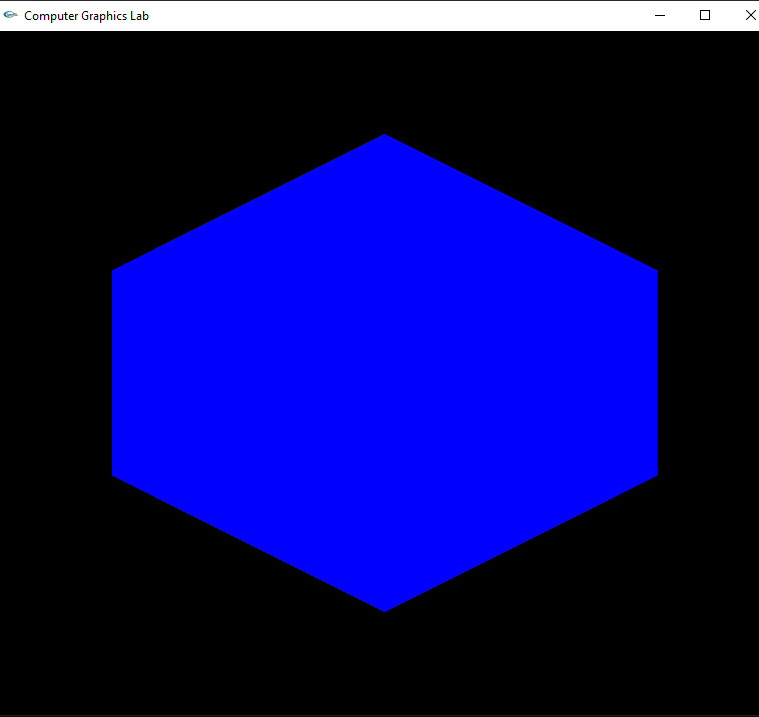

# Computer Graphics Lab
### You can Find Source Code : Lab -> main.cpp
### What we have done 
1. Draw two lines
2. Make a Triangles + Quads = Home
3. Make a Polygon 
4. Make a Start 

#### Planning - Draw a lines 

## Actual Graphics Window - For Lines

## Design - Make a Home 

## Actual Output - For Home (Triangle + Quads=Home)

## Design - Make a Polygon

## Actual Output - For Polygon

