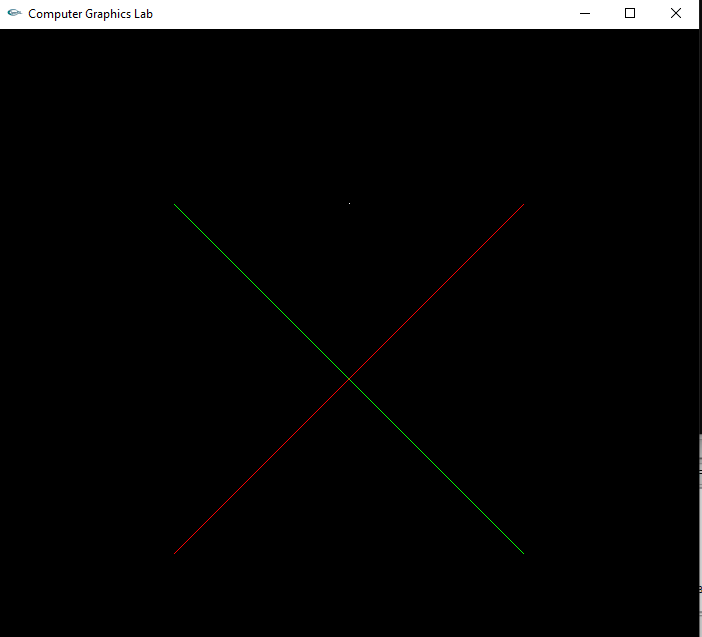

# Computer Graphics Lab
 
Source Code : Lab / main.cpp 
 	Language: C++ 
	Library : OpenGL 
	
 
## Planning - Draw a lines 

## Actual Graphics Window - For Lines

## Design - Make a Home 

## Actual Output - For Home (Triangle + Quads=Home)

## Design - Make a Polygon

## Actual Output - For Polygon

